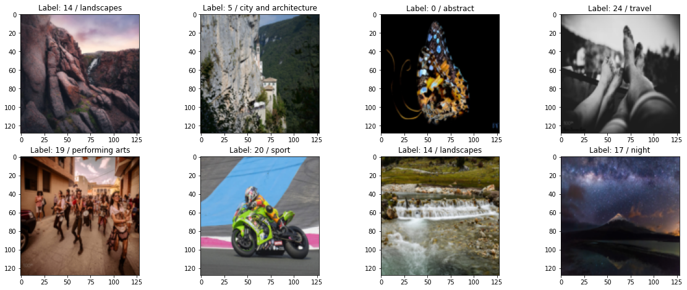
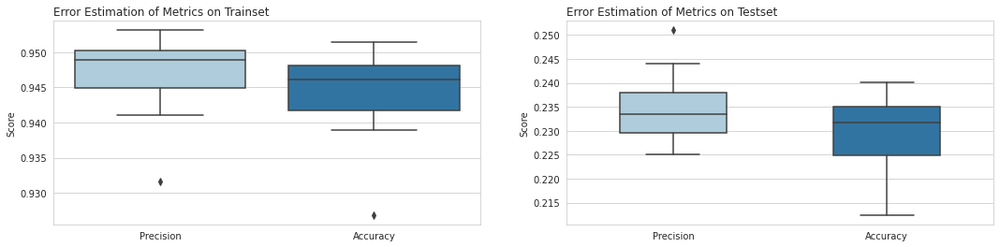
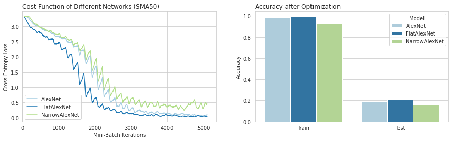
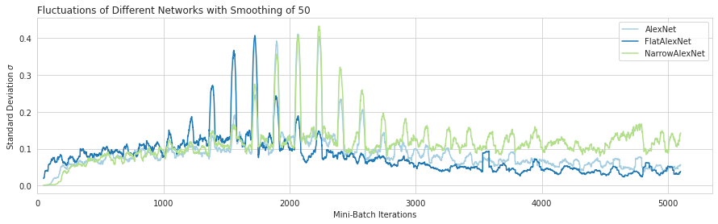
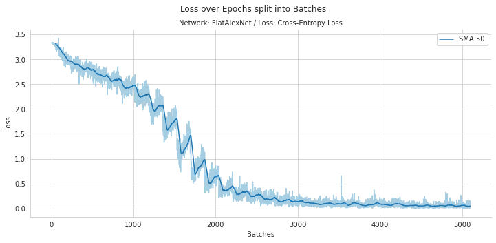
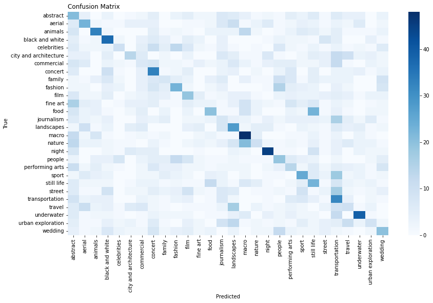
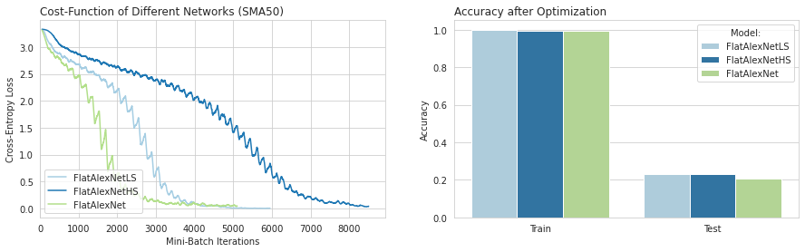
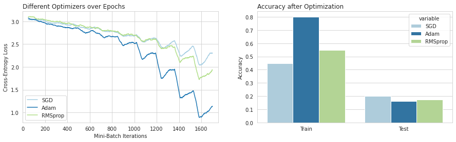

# Study Course Deep Learning MC1 - Image Classification

**Author:** Simon Staehli / 5Da

## Einleitung

Dieses Markdown dient als Dokumentation vom gesamten Code, den ich während der Mini-Challenge geschrieben habe. Dabei werde ich einzelne Bestandteile als Bilder hier darstellen und passend erläutern. Dies bietet vor allem den Vorteil, da das Notebook eine sehr grosse Durchlaufzeit benötigt und es so einfacher ist, Zwischeresultate als Bilder abzuspeichern und in diesem Markdown zu laden. Zur Inspektion des Codes verweise ich innerhalb dieses Markdowns auf das Notebook `del_image_classification.ipynb`.

## Use-Case

Für diese Mini-Challenge habe ich ein eigenen Datensatz zusammengestellt aus diversen Bilder, welche mit Klassen gelabelt sind.
Der Datensatz besteht aus ca. 29'000 Bilder und 28 Labels. 1000 Bilder pro Label. Die Daten habe ich von der folgenden Webseite kollektiert: https://500px.com/. Das Ziel ist es nun die Bilder anhand dieser Labels richtig zu labeln. Dies möchte ich anhand eines CNN-Models erreichen. Im Nachfolgenden werde ich verschiedene Modelle, Optimizer, Regularisierungsmethoden vergleichen. Ausserdem werde ich Transfer-Learning anhand eines vortraininerten Neuronalen Netzes verwenden, dass auf einem weitaus grösseren Datensatz vortrainiert wurde, wie z.B. ImageNet.

### Datenqualität

Die Datenqualität und die Ground Truth entspricht den vorhandenen Abstraktion der Nutzer der Webseite. Es kann sein, dass die Klassenunterteilung einen hohen Bias hat, zumal Bilder unterschiedlicher Bildklassen sehr ähnlich aussehen können.

1. Bias durch das Labelling der Nutzer
2. Bias durch sehr ähnlich aussehende Klassen. z.B. Celebrities und People
3. Falsch gesetzte Labels

Dies könnte in einem nächsten Schritt umgagngen werden, wenn zum Beispiel die Bildklasse Celebrity mit People kombiniert wird, da eine Unterscheidung selbst für das menschliche Auge schier unmöglich ist.

# Vorbereitung des Datensatzes

### Generierung Datensatz für Train-Test-Split

Nun werde ich nachfolgend basierend auf meinen gesammelten Daten eine neue Ordnerstruktur generieren, ein Train-Test Split Erstellen und als Dictionary speichern und das Dictionary vorbereiten für das Kopieren der Bilder in einen Neuen Ordner mit Multiprocessing. Die Ordnerstruktur ist nach dem Pre-Processing in zwei separate Subordner _train_ und _test_ aufgeteilt. Diese beinhalten weitere Subordner mit den Labelnamen und deren Bilder. Das ganze habe ich im Verhältnis 0.9 gesplittet.

## Dataloader

Zuerst muss ich einige Preprozessierungsschritte bei der Bearbeitung der Bilder vornehmen. Dafür verwende ich die Klasse `Compose` von torchvision. Torchvision beinhaltet auch Schritte, die auf Bilder angewendet werden können. Für meine Bilder verwende ich: `Resize, CenterCrop, ToTensor` in dieser Reihenfolge.

|  | 
|:--:| 
| *Sample Bilder aus meinem Datensatz* |


Man kann nun sehen, dass alle Bilder die gleiche Grösse haben und ähnlich aussehen. Das Preprocessing mit Pytorch hat funktioniert. 
Nun werde ich den gleichen Schritt nochmals wiederholen, nur werde ich noch eine Normalisierung des Tensors anfügen.


# Convolutional Neuronal Network

## Sneak Peek

|  | 
|:--:| 
| *CNN Netzwerkarchitektur (Quelle: Gurucharan, 2020, upgrad.com)* |

Die CNN-Architektur trägt ihren Namen aufgrund der vorhandenen Konvolutionsschichten, die im vorderen Teil des Netzwerks vorhanden sind, sprich vor den Fully-Connected Layer platziert sind. Die Konvolutionsschichten bestehen aus einer bestimmten Anzahl Filter, die unterschiedliche Weights aufweisen. Diese Filter fahren in vorgegebener Grösse (Kernelsize) und Schrittzahl (Stride) über das Bild und extrahieren so Features, die in sogenannten Feature Maps resultieren. Aufgrund der unterschiedlichen Filtergewichte werden unterschiedliche Bildmerkmale aufgenommen, wie Ecken und Kanten in einem Bild. Die Konvolutinsschichten werden oftmals mit einer nachfolgenden Poolingschicht kombiniert. Die Poolingschichten ziehen aus den Feature Maps jeweils neue Feature und dienen oftmals zur Datenreduktion. Die Poolingschichten werden meistens als Max-Pooling (Maximalwert aus Kernel an bestimmter Position) oder auch als Average-Pooling (Durchschnittswert des Kernels in einer bestimmten Position) definiert.

## Feature Maps

Zur Berechnung der Dimensionalität der Feature Maps ergibt sich die Formel aus [(Li et al., 2017, Slide 61)](http://cs231n.stanford.edu/slides/2017/cs231n_2017_lecture5.pdf):

$$Output Size= \frac{W-F+2P}{S}+1$$

$W$ stellt hier den vorherigen Input dar. Dies kann ein Eingangsbild oder auch eine bereits extrahierte Feature Map sein. Die wird mit der Kernelgrösse $F$ subtrahiert und anschliessend (falls vorhanden) mit einem  Padding $P$ addiert auf beiden Seite, daher $2*P$. Danach wird das Ganze durch den Stride $S$ dividiert und das Resultat mit eins addiert.


- Gradient der Filterweights

## Implementation von AlexNet

### Architecture

AlexNet war eines der ersten Netzwerke, welches über die Aktivierungsfunktion Re-Lu(Rectifieed Linear Units) und Drop-out zur Regularisierung beinhaltete. Mit _60M_ Parametern war es zu der Zeit eines der grössten Netzwerkarchitekturen [(Karim, 2019)](https://towardsdatascience.com/illustrated-10-cnn-architectures-95d78ace614d#e971)

|  | 
|:--:| 
| *Netzwerkarchitektur von AlexNet (Quelle: [Aremu on Medium, 2021](https://medium.com/analytics-vidhya/alexnet-a-simple-implementation-using-pytorch-30c14e8b6db2) )* |

Das Netzwerk verfügt über 5 Konvolutionsschichten und drei Max-Pooling Layer. Das angehängte Multi-Layer Perceptron verfügt über die Dimensionen von _4096x4096xN-Klassen_.

### Code

Die Pytorch Impelementation von AlexNet konnte ich von Aremu [(2021)](https://medium.com/analytics-vidhya/alexnet-a-simple-implementation-using-pytorch-30c14e8b6db2) übernehmen. Der Code der Implementation des Netzwerks in Pytorch sieht wie folgt aus:

```python
class AlexNet(nn.Module):
    def __init__(self, n_classes):
        super(AlexNet, self).__init__()
        self.conv1 = nn.Conv2d(in_channels=3, out_channels= 96,
                               kernel_size= 11, stride=4, padding=0)
        self.maxpool = nn.MaxPool2d(kernel_size=3, stride=2)
        self.conv2 = nn.Conv2d(in_channels=96, out_channels=256,
                               kernel_size=5, stride= 1, padding= 2)
        self.conv3 = nn.Conv2d(in_channels=256, out_channels=384,
                               kernel_size=3, stride= 1, padding= 1)
        self.conv4 = nn.Conv2d(in_channels=384, out_channels=384,
                               kernel_size=3, stride=1, padding=1)
        self.conv5 = nn.Conv2d(in_channels=384, out_channels=256,
                               kernel_size=3, stride=1, padding=1)
        self.fc1  = nn.Linear(in_features= 9216, out_features= 4096)
        self.fc2  = nn.Linear(in_features= 4096, out_features= 4096)
        self.fc3 = nn.Linear(in_features=4096 , out_features=n_classes)

    def forward(self,x):
        x = F.relu(self.conv1(x))
        x = self.maxpool(x)
        x = F.relu(self.conv2(x))
        x = self.maxpool(x)
        x = F.relu(self.conv3(x))
        x = F.relu(self.conv4(x))
        x = F.relu(self.conv5(x))
        x = self.maxpool(x)
        x = x.reshape(x.shape[0], -1)
        x = F.relu(self.fc1(x))
        x = F.relu(self.fc2(x))
        x = self.fc3(x)
        return x
```

### Wahl der Metriken

Da ich eine ausbalancierte Klassenverteilung habe von den Bildklassen, die ich selbst von der Webseite heruntergeladen habe, habe ich als erste Metrik für den Vergleich `Accuracy` genommen. Accuracy eignet sich aufgrund dieser Klassenbalanciertheit und liefert wahrheitsgetreue Resultate. Als zweite Metrik übernehme ich `Precision`, welche abbildet wieviele meiner Klassenvorhersagen tatsächlich der Wahrheit entsprechen. Dabei wird mit Accuracy die Genauigkeit auf dem gesamten Datensatz angeschaut und Precision fokussiert sich lediglich auf die gemachten Vorhersagen des Modells.

$$\text{Accuracy}=\frac{TP+TN}{TP+TN+FP+FN} $$

Die Accuracy bildet die Gesamtanzahl der richtig Vorhergesagten ins Verhältnis zur Gesamtzahl der Samples. 

$$\text{Macro-Precision}=\frac{\sum^{K}_{k=1} \frac{TP_k}{TP_k+FP_k}}{K}$$

Precision mit einem Macro-Averaging bildet das Verhältnis jeder vorhergesagten Klasse  zur Gesamtzahl der Klassenvorhersage. Danach wird der Durchschnitt über alle Klassen hinweg gebildet. 

### Fehler der Metriken


|  | 
|:--:| 
| *Vergleich der Drei Netzwerkarchitekturen* |

## Hyperparameter-Tuning

Die Netzwerke wurden mit Stochastic Gradient Descent (SGD) mit Momentum optimiert und Mini-Batches. Für die optimalen Einstellungen habe ich für die Batches die Anzahl genommen, die gerade für eine gute Auslastung der GPU und auch des Speichers sorgen. Für den Mini-Batch wählte ich eine Grösse von 150 Bildern. Die Wahl der Lernrate und des Momentums machte ich so, dass ich die Optimierungsschritte des Netzwerks als Running Loss bei jedem MB und der Accuracy einer Epoch überwachte. Die Lernrate erhöhte ich sobald ich merkte, wenn sich die Schrittweite des Running Loss nicht merklich reduzierte oder zu stark fluktuierte. Vom Momentum machte ich Gebrauch, wenn ich merkte, dass mögliche Minimas nicht gefunden wurden, sprich die Optmierungskosten plötzlich drastisch anstiegen.


### Vergleich von 3 Modellen

Den Vergleich diverser Netzwerkarchitekturen könnte man beliebig ausweiten, da es unendliche Möglichkeiten von verschiedenen Parameterkonstellationen gibt, die man hier miteinbringen könnte. Ich habe mich spezifisch auf die Implementation von `AlexNet` fokussiert und deshalb dieses Netzwerk mit zwei Adaptionen neu implementiert. Die Anpassungen für das erste Netzwerk `FlatAlexNet` basiert auch auf AlexNet doch es wurden zwei Konvolutionsschichten entfernt (Reduktion der Netzwerktiefe). Die nächste angepasste Version von AlexNet ist das `NarrowAlexNet` dabei wurde die Netzwerkweite angepasst, in dem die Anzahl der erzeugten Feature Maps reduziert wurde. Der Code der Netzwerke befindet sich im Python-File `networks.py`.

|  | 
|:--:| 
| *Vergleich der Drei Netzwerkarchitekturen* |

Der linke Plot zeigt die Kostenfunktion über die Batch-Iteratinen hinweg aller drei angewendeten Netzwerke dargestellt als rollender Mittelwert, aufgrund der starken Fluktuationen. Natürlich fällt hier ein Direktvergleich schwer, weil die Hyperparameter für der Verlauf der Kostenfunktion stark abhängig ist von der Wahl der Hyperparameter für die Optimierung. Die Grafik zeigt, dass das `FlatAlexNet` mit geringerer Tiefe den am schnellsten sinkenden Loss zeigt. `AlexNet und FlatAlexNet` fitten das Trainingset besser als das `NarrowAlexNet` was am Schluss sehen schön in der Grafik sehen kann. Aus dieser Grafik kann ich für die Optimierung auf den Datensatz schliessen, dass mit mehr generierten Feature Maps die Daten besser gefittet werden können. Deshalb macht es sinn eine breite Netzwerkarchitekture zu verwenden. Wenn man nun `AlexNet und FlatAlexNet` genauer betrachtet, dann kann man sehen, dass das FlatAlexNet den Datensatz viel schneller fitted als AlexNet, was wahrscheinlich an der kleineren Anzahl der zu optimierenden Parameter und dessen zugrundeliegender Hyperebene liegt. Beide Netzwerke fitten die Daten sehr gut.
Der zweite Plot der Accuracy auf den Trainings -und den Testdaten wiederspiegeln eine ähnliches Muster. Jedoch hätte ich durch das Overfitten des Trainingsdatensatzes einen höhere Varianz erwartet auf den Testdaten erwartet, als mit dem Modell, das den Datensatz nicht so präzise gefittet hat. Auf diesem Datensatz macht dies wahrscheinlich nicht sehr viel aus, da die einzelnen Bildklassen allgemein einen hohen Bias vorweisen, weil die Bildklassen darin leicht vertauschbar sind.

Nun erhaschen wir eine Blick auf die jeweilige Standardabweichung welches über ein Fenster von jeweils 50 Iterationen genommen wurde, sowie beim vorherigen Plot.

|  | 
|:--:| 
| *Vergleich der Drei Netzwerkarchitekturen über Batches hinweg anhand der Standardabweichung* |

Die Grafik zeigt die Streuung der einzelnen Kostenfunktionsmesswerte mit einem Smoothing Average von 50 Iterationen. Es bildet ein ähnliches Resultat ab, wie der Mittelwert über 50 Iterationen hinweg von der vorhergehenden Grafik. Man kann sehen, das im Bereich 1000-3000 eine sehr starke Streuung im sinne der Standardabweichung vorherrscht. Dieser Verlauf wird auch bestärkt durch die batchweise Anpassung der Gradienten. Es kann auch angenommen werden, dasss bei allen drei Modellen an diesen Punkten starke Potentialunterschiede in der darunterliegenden Hyperebene vorzufinden waren. Die Potentialunterschiede werden von AlexNet und FlatAlexNet im späteren Verlauf gut angenommen.


### FlatAlexNet

|  | 
|:--:| 
| *Kostenfunktion von AlexNet über Batches hinweg* |

Der Plot zeigt den Verlauf der Kostenfunktion über alle Batches hinweg vom `FlatAlexNet`. Man kann sehen, dass die Gradienten erst ca. ab 1000 Batches die Kostenfunktion merklich reduzieren. Danach pendelt sich der Verlauf auf einem tiefen Niveau nahe 0 ein. Aufgrund der Batches ist es schwer die Abbruchbedingung zu erfüllen, da die Kostenfunktion durch die Mini-Batches stark varriieren kann und deshalb das Abnahmekriterium $\epsilon$ schwerer zu erreichen ist.

|  | 
|:--:| 
| *Confusion Matrix aus Vorhersagen auf dem Testset* |

Der Plot zeigt die Confusions-Matrix respektive die Vorhergesagten Labels gegenübergestellt mit der Ground Truth. Das Bild zeigt, dass sich die meisten Labels bereits auf der Diagonalen befinden und somit als `TP` angenommen werden. Interessant sind doch vor allem die Labels, die vom Modell nicht gut getroffen werden: _Commercial, Family, Fine Art, Journalism, Nature, Street und Travel_. Die Bildklassen _BW, Macro, Night, Animals und Underwater_ werden am besten vom Modell getroffen. Anhand der vorliegenden Matrix kann man interpretieren, wo die grössten Verwechslungen vorliegen. Die Verwechslungen liegen, wie angenommen, in vielen Bildklassen vor, in welchem vorwiegend Menschen darin vorkommen und schwer zu unterscheiden sind: Celebtrities, People, Fashion, Family. Solche Bildklassen wären auch für einen Menschen schwer zu unterscheiden. Ausserdem sieht man auch starke Fehler zwischen Landscape und Travel, Nature und Macro, Food und Still Life, Transportation mit Street und Sport. Gerade beim letzten ist eine Verwechslung von Transportation gut vorstellbar, da in beiden Fotos viele Autos und sonstige Fahrzeuge zu sehen sind. Bei der Verwechslung von Transportation mit Sport jedoch ist dies weniger der Fall, ausser es gäbe womöglich Bilder die Motorsport zeigen. Tatsächlich existieren in den Trainingsdaten viele Bilder, die Motorsport zeigen, wie DirtBikes oder auch Autos, die natürlich leicht verwechselbar mit Bildern aus Transportation sind.
Eine Möglichkeit wäre die schwer unterscheidbaren Klassen miteinander zu in eine Klasse zu verschmelzen. Diese würde am Modell helfen eine bessere Unterscheidung zu machen. Ich denke, dass auch mit noch mehr Bildern pro Bildklasse es dennoch schwer wäre gute Vorhersagen für diese gut verwechselbaren Klassen zu machen.

### Optimierung des Strides

|  | 
|:--:| 
| *Vergleich der Drei Netzwerkarchitekturen* |


### Optimierung der Filtergrössen


### Vorhersagen

### Vergleich Optimizer

Den Vergleich der Optimizer überwache ich über den Lernprozess hinweg. Über den Lernprozess kann man sehen, wie sich der Optimzer verhält über die einzelnen Batches verhält, sprich wie sich die Kostenfunktion mit steigender Iteration verändert. Bezüglich der Reproduzierbarkeit habe ich nach einer Epoch von SGD die Modellparameter abgespeichert, die ich nun als Ausgangspunkt für alle Optimizer verwende. Ausserdem verwende ich für den Vergleich die gleiche Anzahl der Epochen, nämlich 10. Es ist hier zu erwähnen, dass ein Vergleich schwer fällt, da die Optimizer verschiedene Parameter verfügen z.B. Lernrate und Momentum bei SGD, die man ebenfalls berücksichtigen muss beim Training. Dies werde ich jedoch im Prozess nicht stark berücksichtigen. Ich habe für meinen Teil einige Durchläufe gemacht und geschaut wie sich die laufenden Kosten verändern. Zu schwache Veränderungen habe ich mit einer Erhöhung der Kostenfunktion gegensteuert.

#### SGD

Stochastic Gradient Descent nimmt über jeden Batch hinweg ein Random Sample mit welchem er dann die Gewichte updated. Dies hat den Vorteil, dass die Rechenintesität viel kleiner wird, zu mal bspw. nur ein Sample verarbeitet werden muss. Teilweise werden auch mehrere kleinere Samples genommen (Batches) [(Srinivasan, 2019)](https://towardsdatascience.com/stochastic-gradient-descent-clearly-explained-53d239905d31).


#### Adam

#### RMSprop

### Vergleich

|  | 
|:--:| 
| *Vergleich der Optimizer über Batches hinweg* |


# Quellen

https://towardsdatascience.com/stochastic-gradient-descent-clearly-explained-53d239905d31

https://www.upgrad.com/blog/basic-cnn-architecture/

http://cs231n.stanford.edu/slides/2017/cs231n_2017_lecture5.pdf

https://towardsdatascience.com/illustrated-10-cnn-architectures-95d78ace614d#e971

https://medium.com/analytics-vidhya/alexnet-a-simple-implementation-using-pytorch-30c14e8b6db2