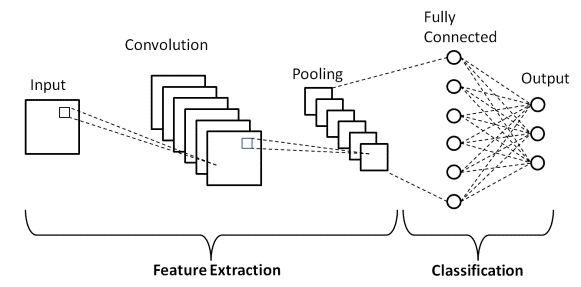
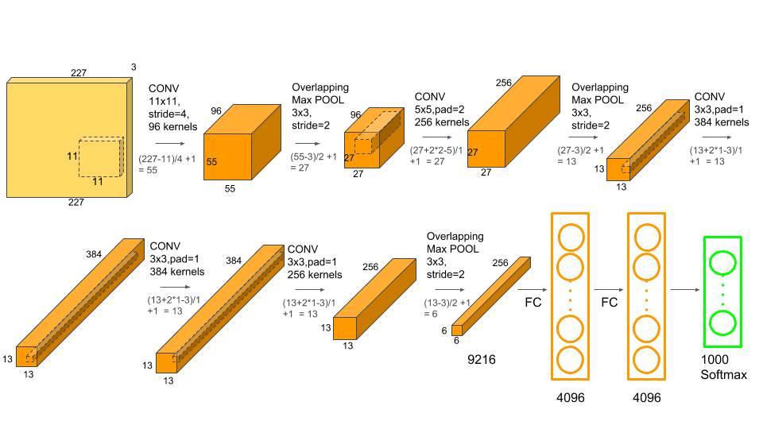

# Study Course Deep Learning MC1 - Image Classification

**Author:** Simon Staehli / 5Da

## Einleitung

Dieses Markdown dient als Dokumentation vom gesamten Code, den ich während der Mini-Challenge geschrieben habe. Dabei werde ich einzelne Bestandteile als Bilder hier darstellen und passend erläutern. Dies bietet vor allem den Vorteil, da das Notebook eine sehr grosse Durchlaufzeit benötigt und es so einfacher ist, Zwischeresultate als Bilder abzuspeichern und in diesem Markdown zu laden. Zur Inspektion des Codes verweise ich innerhalb dieses Markdowns auf die einzelnen Notebooks im Ordner `./tasks`.

## Use-Case

Für diese Mini-Challenge habe ich ein eigenen Datensatz zusammengestellt aus diversen Bilder, welche mit Klassen gelabelt sind.
Der Datensatz besteht aus ca. 29'000 Bilder und 28 Labels, was ungefähr in 1000 Bilder pro Label resultiert. Die Daten habe ich von der folgenden Webseite kollektiert: https://500px.com/. Das Ziel ist es nun die Bilder anhand dieser Labels richtig zu labeln. Dies möchte ich anhand eines CNN-Models erreichen. Im Nachfolgenden werde ich verschiedene Modelle, Optimizer, Regularisierungsmethoden vergleichen. Ausserdem werde ich Transfer-Learning anhand eines vortraininerten Neuronalen Netzes verwenden, dass auf einem weitaus grösseren Datensatz vortrainiert wurde.

### Datenqualität

Die Datenqualität und die Ground Truth entspricht der vorhandenen Abstraktion der Nutzer der Webseite (vorwiegend Fotografen). Es kann sein, dass die Klassenunterteilung einen hohen Bias hat, zumal Bilder unterschiedlicher Bildklassen sehr ähnlich aussehen können und es durchaus Überlappungen zwischen denen gibt. Eine Auflistung potenzieller Schwierigkeiten:

1. Bias durch das Labelling der Nutzer
2. Bias durch sehr ähnlich aussehende Klassen. z.B. Celebrities und People
3. Falsch gesetzte Labels von Nutzern

Dies könnte in einem nächsten Schritt umgagngen, wenn ähnliche Bildklassen kombiniert werden würden. Zum Beispiel eine Kombination der Bildklassen Celebrity und People, da eine Unterscheidung selbst für das menschliche Auge schier unmöglich ist.

# Vorbereitung des Datensatzes

### Generierung Datensatz für Train-Test-Split

Meine gesammelten Daten habe ich als Ordnerstruktur abgespeichert, die es mir noch nicht ermöglichte, die Daten geeignet zu laden. Deshalb habe ich eine neue Ordnerstruktur generiert, welches ein Train-Test Split darstellt. Die Ordnerstruktur ist nach dem Pre-Processing in zwei separate Subordner _train_ und _test_ aufgeteilt. Diese beinhalten weitere Subordner mit den Labelnamen und deren Bilder. Das ganze habe ich im Verhältnis 0.9 gesplittet. Der Code kann `./tasks/s1_dataset.ipynb` und `helper.py` nachgeschaut werden.

## Dataloader

Zuerst muss ich einige Preprozessierungsschritte bei der Bearbeitung der Bilder vornehmen. Dafür verwende ich die Klasse `Compose` von torchvision. Torchvision beinhaltet auch Schritte, die auf Bilder angewendet werden können. Für meine Bilder verwende ich: `Resize, CenterCrop, ToTensor, Normalize` in dieser Reihenfolge.

|  | 
|:--:| 
| *Sample Bilder aus meinem Datensatz (ohne Normalize)* |

Man kann nun sehen, dass alle Bilder die gleiche Grösse haben und ähnlich aussehen. Das Preprocessing mit Pytorch hat funktioniert. 
Nun werde ich den gleichen Schritt nochmals wiederholen, nur werde ich noch eine Normalisierung des Tensors anfügen, denn Normalize verändert die Farbgebung der Bilder stark, was sie für einen Menschen schlecht erkenntlich macht. Die Normalisierungswerte für den Mean und Standardabweichung habe ich analog zu Beispielen aus dem Internet gemacht. z.B. Pre-Processng für [(AlexNet)](https://pytorch.org/hub/pytorch_vision_alexnet/)


# Convolutional Neuronal Network

## Sneak Peek

|  | 
|:--:| 
| *CNN Netzwerkarchitektur (Quelle: Gurucharan, 2020, upgrad.com)* |

Die CNN-Architektur trägt ihren Namen aufgrund der vorhandenen Konvolutionsschichten, die im vorderen Teil des Netzwerks vorhanden sind, sprich vor den Fully-Connected Layer platziert sind. Die Konvolutionsschichten bestehen aus einer bestimmten Anzahl Filter, die unterschiedliche Weights aufweisen. Diese Filter fahren in vorgegebener Grösse (Kernelsize) und Schrittzahl (Stride) über das Bild und extrahieren so Features, die in sogenannten Feature Maps resultieren. Aufgrund der unterschiedlichen Filtergewichte werden unterschiedliche Bildmerkmale aufgenommen, wie Ecken und Kanten in einem Bild. Die Konvolutinsschichten werden oftmals mit einer nachfolgenden Poolingschicht kombiniert. Die Poolingschichten ziehen aus den Feature Maps jeweils neue Feature und dienen oftmals zur Datenreduktion. Die Poolingschichten werden meistens als Max-Pooling (Maximalwert aus vorgegebenen Kernel) oder auch als Average-Pooling (Durchschnittswert des vorgegebenen Kernels) definiert.

## Feature Maps

Zur Berechnung der Dimensionalität der Feature Maps ergibt sich die Formel aus [(Li et al., 2017, Slide 61)](http://cs231n.stanford.edu/slides/2017/cs231n_2017_lecture5.pdf):

$$Output Size= \frac{W-F+2P}{S}+1$$

$W$ stellt hier den vorherigen Input dar. Dies kann ein Eingangsbild oder auch eine bereits extrahierte Feature Map sein. Die wird mit der Kernelgrösse $F$ subtrahiert und anschliessend (falls vorhanden) mit einem  Padding $P$ addiert auf beiden Seite, daher $2*P$. Danach wird das Ganze durch den Stride $S$ dividiert und das Resultat mit eins addiert.

## Implementation von AlexNet

### Architecture

AlexNet war eines der ersten Netzwerke, welches über die Aktivierungsfunktion Re-Lu(Rectifieed Linear Units) und Drop-out zur Regularisierung beinhaltete. Mit _60M_ Parametern war es zu der Zeit eines der grössten Netzwerkarchitekturen [(Karim, 2019)](https://towardsdatascience.com/illustrated-10-cnn-architectures-95d78ace614d#e971)

|  | 
|:--:| 
| *Netzwerkarchitektur von AlexNet (Quelle: [Aremu on Medium, 2021](https://medium.com/analytics-vidhya/alexnet-a-simple-implementation-using-pytorch-30c14e8b6db2) )* |

Das Netzwerk verfügt über 5 Konvolutionsschichten und drei Max-Pooling Layer. Das angehängte Multi-Layer Perceptron verfügt über die Dimensionen von _4096x4096xN-Klassen_. Ein weiterer Aspekt des Netzwerks sind die über _60Mio_ trainierbaren Parameter.

### Code

Die Pytorch Impelementation von AlexNet konnte ich von Aremu [(2021)](https://medium.com/analytics-vidhya/alexnet-a-simple-implementation-using-pytorch-30c14e8b6db2) übernehmen. Der Code der Implementation des Netzwerks in Pytorch ohne Dropout sieht wie folgt aus:

```python
class AlexNet(nn.Module):
    def __init__(self, n_classes):
        super(AlexNet, self).__init__()
        self.conv1 = nn.Conv2d(in_channels=3, out_channels= 96,
                               kernel_size= 11, stride=4, padding=0)
        self.maxpool = nn.MaxPool2d(kernel_size=3, stride=2)
        self.conv2 = nn.Conv2d(in_channels=96, out_channels=256,
                               kernel_size=5, stride= 1, padding= 2)
        self.conv3 = nn.Conv2d(in_channels=256, out_channels=384,
                               kernel_size=3, stride= 1, padding= 1)
        self.conv4 = nn.Conv2d(in_channels=384, out_channels=384,
                               kernel_size=3, stride=1, padding=1)
        self.conv5 = nn.Conv2d(in_channels=384, out_channels=256,
                               kernel_size=3, stride=1, padding=1)
        self.fc1  = nn.Linear(in_features= 9216, out_features= 4096)
        self.fc2  = nn.Linear(in_features= 4096, out_features= 4096)
        self.fc3 = nn.Linear(in_features=4096 , out_features=n_classes)

    def forward(self,x):
        x = F.relu(self.conv1(x))
        x = self.maxpool(x)
        x = F.relu(self.conv2(x))
        x = self.maxpool(x)
        x = F.relu(self.conv3(x))
        x = F.relu(self.conv4(x))
        x = F.relu(self.conv5(x))
        x = self.maxpool(x)
        x = x.reshape(x.shape[0], -1)
        x = F.relu(self.fc1(x))
        x = F.relu(self.fc2(x))
        x = self.fc3(x)
        return x
```

### Wahl der Metriken

Da ich eine ausbalancierte Klassenverteilung habe von den Bildklassen, die ich selbst von der Webseite heruntergeladen habe, habe ich als erste Metrik für den Vergleich `Accuracy` gewählt. Accuracy eignet sich aufgrund dieser Klassenbalanciertheit und liefert wahrheitsgetreue Resultate. Als zweite Metrik nehme ich `Precision`, welche abbildet wieviele meiner Klassenvorhersagen tatsächlich der Wahrheit entsprechen. Dabei wird mit Accuracy die Genauigkeit auf dem gesamten Datensatz angeschaut und Precision fokussiert sich lediglich auf die richtig und falschen Vorhersagen des Modells pro Klasse.

$$\text{Accuracy}=\frac{TP+TN}{TP+TN+FP+FN} $$

Die Accuracy bildet die Gesamtanzahl der richtig Vorhergesagten ins Verhältnis zur Gesamtzahl der Samples. Bei Multiclass-Klassifizierung unterscheidet man für die Berechnung der Accuracy nicht zwischen _TN_ und _TP_ entspricht.

$$\text{Macro-Precision}=\frac{\sum^{K}_{k=1} \frac{TP_k}{TP_k+FP_k}}{|K|}$$

Precision mit einem Macro-Averaging bildet das Verhältnis jeder vorhergesagten Klasse $k$ zur Gesamtzahl der Klassenvorhersage. Danach wird der Durchschnitt über alle Klassen hinweg gebildet. Wichtig hier ist, dass die Metrik für jede Klasse einzeln berechnet wird.

### Fehler der Metriken

|  | 
|:--:| 
| *Vergleich der Drei Netzwerkarchitekturen (10 Folds)* |

Der Plot zeigt den Fehler den Metriken über 10 separate Splits hinweg. Da ich aufgrund der Rechenintensität dies nicht bei jedem Fitten des Modells machen kann, habe ich dies einmal symbolisch für jeden Fit dargestellt. Der Plot auf der linken Seite zeigt den Fehler auf dem Trainingsset. Man kann sehen, dass nach N-Epochen das Trainingsset nicht 100% gefittet wurde. Der IQR beläuft sich bei beiden Metriken auf ca. 0.5%. Bei beiden Messungen gab es einen Ausreisser, welcher vermutlich auf den gleichen Fold zurückzuführen ist und deutet auf eine Instabilität hin. Dies kann durchaus sein, weil imho die Bildinhalte pro Klasse stark streuen und ich nicht sehr viele Bilder habe.
Bei dem rechten Plot sieht man den Fehler über 10-folds auf dem Testset. Hier ist das Resultat beider Metriken viel kleiner, was verständlich ist. Was man hier feststellen kann, dass die Streuung z.B. dargestellt durch IQR oder die Whisker viel grösser ist als auf den Trainingsdaten. Die Messungen pro Fold reichen bei der Accuracy von etwas weniger als 21.5% bis auf 24%. Das Resultat lässt sich mit der These, dass sich die Bilder innerhalb einer Klasse stark unterscheiden und auch klassenübergreifend sehr ähnlich auussehen können, vereinbaren. Eine grosse Streuung deutet auf ein eher unrobustes Modell oder schlechte Datenlage hin.

## Hyperparameter-Tuning

Die Netzwerke wurden mit Mini-Batch Gradient Descent und mit Momentum optimiert. Für die optimalen Einstellungen habe ich für die Batches die Anzahl genommen, die gerade für eine gute Auslastung der GPU und auch des Speichers sorgen. Für den Mini-Batch wählte ich eine Grösse von ~150 Bildern (kann sich manchmal unterscheiden). Die Wahl der Lernrate und des Momentums machte ich so, dass ich die Optimierungsschritte des Netzwerks als Running Loss bei jedem MB überwachte. Die Lernrate erhöhte ich, sobald ich merkte, wenn sich die Schrittweite des Running Loss nicht merklich reduzierte oder zu stark fluktuierte. Vom Momentum machte ich Gebrauch, wenn ich merkte, dass mögliche Minimas nicht gefunden wurden, sprich die Optmierungskosten plötzlich drastisch anstiegen, obwohl sie bereits auf einem tieferen Niveau waren.


### Vergleich von 3 Modellen

Den Vergleich diverser Netzwerkarchitekturen könnte man beliebig ausweiten, da es unendliche Möglichkeiten von verschiedenen Parameterkonstellationen gibt, die man hier miteinbringen könnte. Ich habe mich spezifisch auf die Implementation von `AlexNet` fokussiert und deshalb dieses Netzwerk mit zwei Adaptionen neu implementiert. Die Anpassungen für das erste Netzwerk `FlatAlexNet` basiert auch auf AlexNet doch es wurden zwei Konvolutionsschichten entfernt (Reduktion der Netzwerktiefe). Die nächste angepasste Version von AlexNet ist das `NarrowAlexNet` dabei wurde die Netzwerkweite angepasst, in dem die Anzahl der erzeugten Feature Maps reduziert wurde. Der Code der Netzwerke befindet sich im Python-File `networks.py`.

|  | 
|:--:| 
| *Vergleich der Drei Netzwerkarchitekturen* |

Der linke Plot zeigt die Kostenfunktion über die Batch-Iteratinen hinweg aller drei angewendeten Netzwerke dargestellt als rollender Mittelwert, aufgrund der starken Fluktuationen. Natürlich fällt hier ein Direktvergleich schwer, weil die Hyperparameter für den Verlauf der Kostenfunktionen starken Einfluss hat. Die Grafik zeigt, dass das `FlatAlexNet` mit geringerer Tiefe den am schnellsten sinkenden Loss zeigt. `AlexNet und FlatAlexNet` fitten das Trainingset besser als das `NarrowAlexNet` was am Schluss sehen schön in der Grafik sehen kann. Aus dieser Grafik kann ich für die Optimierung auf den Datensatz schliessen, dass mit mehr generierten Feature Maps die Daten besser gefittet werden können. Deshalb macht es sinn eine breitere Netzwerkarchitektur zu verwenden. Wenn man nun `AlexNet und FlatAlexNet` genauer betrachtet, dann kann man sehen, dass das FlatAlexNet den Datensatz viel schneller fitted als AlexNet. Beide Netzwerke fitten die Daten sehr gut.
Der zweite Plot der Accuracy auf den Trainings -und den Testdaten wiederspiegeln eine ähnliches Muster. Jedoch hätte ich durch das Overfitten des Trainingsdatensatzes einen höhere Varianz auf den Testdaten erwartet, als mit dem Modell, das den Datensatz nicht so präzise gefittet hat. Auf diesem Datensatz könnte dies nicht starken Einfluss haben, da die einzelnen Bildklassen allgemein einen hohen Bias vorweisen, da sie leicht vertauschbar sind.

Nun erhaschen wir eine Blick auf die jeweilige Standardabweichung welches über ein Fenster von jeweils 50 Iterationen genommen wurde, sowie beim vorherigen Plot.

|  | 
|:--:| 
| *Vergleich der Drei Netzwerkarchitekturen über Batches hinweg anhand der Standardabweichung* |

Die Grafik zeigt die Streuung der einzelnen Kostenfunktionsmesswerte mit einem Smoothing Average von 50 Iterationen. Es bildet ein ähnliches Resultat ab, wie der Mittelwert über 50 Iterationen hinweg von der vorhergehenden Grafik. Man kann sehen, das im Bereich 1000-3000 eine sehr starke Streuung im Sinne der Standardabweichung vorherrscht. Dieser Verlauf wird auch bestärkt durch die batchweise Anpassung der Gradienten. Es kann auch angenommen werden, dasss bei allen drei Modellen an diesen Punkten starke Potentialunterschiede in der darunterliegenden Hyperebene vorzufinden waren. Die Potentialunterschiede werden von AlexNet und FlatAlexNet im späteren Verlauf gut angenommen.


### FlatAlexNet

|  | 
|:--:| 
| *Kostenfunktion von AlexNet über Batches hinweg* |

Der Plot zeigt den Verlauf der Kostenfunktion über alle Batches hinweg vom `FlatAlexNet`. Man kann sehen, dass die Gradienten ca. ab 1000 Batches die Kostenfunktion stärker reduzieren. Danach pendelt sich der Verlauf auf einem tiefen Niveau nahe 0 ein. Aufgrund der Batches ist es schwer die Abbruchbedingung zu erfüllen, da die Kostenfunktion durch die Mini-Batches stark varriieren kann und deshalb das Abnahmekriterium $\epsilon$ schwerer zu erreichen ist, was am Ende der Kurve ersichtlich ist.

|  | 
|:--:| 
| *Confusion Matrix aus Vorhersagen auf dem Testset* |

Der Plot zeigt die Confusions-Matrix respektive die Vorhergesagten Labels gegenübergestellt mit der Ground Truth. Das Bild zeigt, dass sich viel der Labels bereits auf der Diagonalen befinden und somit als `TP` angenommen werden können. Interessant sind doch vor allem die Labels, die vom Modell nicht gut getroffen werden: _Commercial, Family, Fine Art, Journalism, Nature, Street und Travel_. Die Bildklassen _BW, Macro, Night, Animals und Underwater_ werden am besten vom Modell getroffen. Anhand der vorliegenden Matrix kann man interpretieren, wo die grössten Verwechslungen vorliegen. Die Verwechslungen liegen, wie angenommen, in vielen Bildklassen vor, in welchem vorwiegend Menschen darin vorkommen und schwer zu unterscheiden sind: _Celebtrities, People, Fashion, Family_. Solche Bildklassen wären auch für einen Menschen schwer zu unterscheiden. Ausserdem sieht man auch starke Fehler zwischen _Landscape und Travel, Nature und Macro, Food und Still Life, Transportation mit Street und Sport_. Gerade beim letzten ist eine Verwechslung von Transportation gut vorstellbar, da in beiden Fotos viele Autos und sonstige Fahrzeuge zu sehen sind. Bei der Verwechslung von _Transportation mit Sport_ jedoch ist dies weniger der Fall, ausser es gäbe womöglich Bilder die Motorsport zeigen. Nach einer kurzen Überprüfung der Daten, weiss ich, dass in den Trainingsdaten viele Bilder existieren, die Motorsport zeigen, wie DirtBikes oder auch Autos, die natürlich leicht verwechselbar mit Bildern aus Transportation sind.
Eine Möglichkeit wäre die schwer unterscheidbaren Klassen miteinander in eine Klasse zu verschmelzen. Diese würde am Modell helfen eine bessere Unterscheidung zu machen.

### Optimierung des Strides

Bei der Optimierung des Strides ging ich so vor, dass ich basierend auf dem vorherigen besten Modell, dem FlatAlexNet eine Veränderung der Strides durchgeführt habe in dem ich für ein Modell die Werte der Strides höher gesetzt habe als für das andere. Dies resultierte in den Netzwerken: `FlatAlexNetHS, FlatAlexNetLS`. Mit den Strides kann man die Menge an Features kontrollieren, die unter den Konvolutionsschichten weitergegeben werden, bis sie anschliessend in den FC Layer gegeben werden. Der Stride definiert die Schrittzahl die mit einem Kernelfilter gemacht werden. Das Resultat sah so aus:

|  | 
|:--:| 
| *Netzwerkarchitekturen mit unterschiedlichen Strides* |

Bei dem Verlauf der Kostenfunktion kann man erkennen, das die Lernrate bei den bei den angepassten Modellen noch nicht gut angepasst war. Dies ist vor allem bei dem Netzwerk mit dem erhöhten Stride ersichtlich. Auch wenn die Anpassung des Netzwerks am längsten gedauert hat, lieferte mir die Variante mit dem erhöhten Stride die besten Resultate mit 23% Accuracy auf dem Testset. Besonders auch hier zu erwähnen, dass beide Varianten bessere Resultate lieferten als das zuvor definierte `FlatAlexNet`. Im weiteren Prozess werde ich mit der Netzwerkarchitektur von `FlatAlexNetHS` weiterfahren. Im weiteren Verlauf werde ich auch die Optimierungsparameter enstprechend anpassen, sodass am Ende das Trainingsset besser und vor allem schneller gefittet werden kann.

### Optimierung der Filtergrössen

Bei dieser Optimierung gings um die Dimensionierung der Filter, die zur Feature Extraktion über das Bild gefahren werden. Hier habe ich zwei Implementationen ,basiernd auf `AlexNetHS`,  erstellt. Eine Implementaton verfügt über grössere Filter und die nächste über kleinere Filter.

|  | 
|:--:| 
| *Netzwerkarchitekturen mit unterschiedlichen Kernel Sizes* |

Die Kostenfunktion sank bei der IMplementation mit den kleinsten Kernelgrössen `FlatAlexNetLowKernel` am schnellsten. Dieses Modell lieferte auch die besten Vorhersageresultate und war ca. 1% besser als der Vorgänger `FlatAlexNetHS` mit 23%. Aus diesen Resultaten schliesse ich nun für meinen Datensatz, dass höhere Strides mit kleineren Filtern bessere Resultate liefert, als andere Konstellationen. Natürlich müsste man hier noch alle anderen Kombinationen testen, doch hier beschränke ich mich inkrementell ein immer besser werdendes Modell zu erhalten.

### Optimierung des MLP-Layers

Nun werde ich noch den Fully-Connected Layer optimieren. Die Optimierung werde ich anhand des Hyperparameter-Tuning Frameworks `optuna` vornehmen [(Akiba et al., 2019)](https://optuna.org/#paper). Mit diesem Framework variiere ich die Anzahl der Layer und die Anzahl der Neuronen in den Layer des MLP's. Durch das zeitaufwendige Training führte ich 20 Versuche durch, die zur Optimierung des Netzwerks beitrugen. Die Optimierung resultierte in einem Netzwerk mit 4 Hidden Layern mit den Grössen 
```python
FC = {'n_layers': 3, 'fc1': 2379, 'fc2': 5592, 'fc3': 7864}
```
Die Güte des Modells pro Optimierungsiteration habe ich über die Metrik Accuracy auf dem Testset bestimmt. Durch die Optimierung konnte ich eine Accuracy von ca. 25% erreichen. Ein besserer Weg für die Optimierung wäre es gewesen bei jeder Iterationen eine Kreuzvalidierung durchzuführen, doch dies war in meinem Fall leider zu zeitaufwendig.
Der Fehler der Metrik des besten Modells sah so aus:

|  | 
|:--:| 
| *Schätzung des Fehelrs des optimierten Netzwerk (5 Folds)* |

Ein Vergleich mit der oberen Grafik ist schwer, da hier eine andere Anzahl an Folds verwendet wurde im Gegensatz zur oberen Grafik. Die Scores auf dem Traniingset sind sehr nahe aufeinander, was auf die gleiche Anzahl der verwendeten Epochen zurückzuführen ist. Es ist anzunehmen, dass der Schätzfehler grösser wird, wenn die Trainingsdaten kleiner sind wie in unserem Fall bei 5facher Kreuzvalidierung anstatt 10facher. Jedoch musste ich weniger Iterationen vornehmen, weil das Training sehr lange gedauert hat. Da sich die Trainingsset unterscheiden fällt ein Vergleich der Lagemasse schwer zur vorgängigen Schätzung des Fehler der Metrik. Im Vergleich zum Fehler der ersten Schätzung (siehe Kapitel _Schätzung des Fehlers_) kann man sehen, dass die Accuracy nun robuster geworden ist anhand des Streumasses IQR und der Whisker. Dies sieht bei der Precision anders aus, da wurde die Streuung grösser. Ingesamt würde ich die Streuung von diesem Modell nicht als gut beurteilen und daraus schliessen, dass das Modell immer noch nicht robust genug ist.

## Regularisierung

Regularisierung hilft einem Modell overfitting auf den Trainingsdaten zu vermeiden und so eine bessere Übertragbarkeit des Trainierten Modells auf die Testdaten abzubilden.

### L1/L2 Regularisierung

Bei der L1 Regularisierung und später auch der L2-Regularisierung wird der Kostenfunktion ein weiterer Additionsterm angehängt. Dies stelle ich vereinfacht dargestellt so dar:

$$J_{L1}(\theta)= \epsilon(y, \hat{y}) + \lambda \sum |\theta|$$

Durch dieses anhängenden des weiteren Terms wird eine weitere Bedingung zur Optimierung des Modells und zur Berechnung der Gradienten beigefügt. Im Falle der L1-Regulariserung wäre es die Summe aller absoluten Beträge, welche im Falle der Ableitung der angehängte L1-Term zu $\frac{\partial f_{L1}(\theta)}{\partial \theta} = \lambda sign(\theta)$ wird. Die Funktion $sign(x)$ gibt als Rückgabe 1, falls x positiv, 0 falls x 0 und -1 falls x negativ ist zurück. Die Gewichtung wird mit dem Hyperparameter $\lambda$ gesteuert. Die Kostenfunktion wird durch die Gewichtung grosser $\theta$-Werte bestraft, was in der Optimerung in Betracht gezogen wird. Eine Besonderheit dieser Regularisierung ist, dass die Gewichte 0 werden können, wobei dies bei L2 anders ist. 

$$J_{L2}(\theta)= \epsilon(y, \hat{y}) + \lambda \sum \theta^2$$

Bei der L2-Regularisierung wird ein anderer Term an die Kostenfunktion gehängt. Der Term summiert alle quadrierten $\theta$ auf. Auch hier kann die Stärke der Regularisierung mit $\lambda$ bestimmt werden. Im Falle der Berechnung der Gradienten sieht der Additionsterm bei der L2-Regularisierung wie folgt aus: $\frac{\partial f_{L2}(\theta)}{\partial \theta} = 2\lambda \theta$. Diese Regularisierungstechnik bestraft grosse Gewichte noch stärker aufgrund des quadratischen Terms.

### Dropout

| | 
|:--:| 
| *Dropout verbildlicht (Quelle: Dropout: A simple Way to Prevent Overfitting, Srivasan et al., 2014)* |


"The key idea is to randomly drop units (along with their connections) from the neural
network during training. This prevents units from co-adapting too much [(Srivastava et al.,2014)](https://jmlr.org/papers/volume15/srivastava14a/srivastava14a.pdf).
Nach dieser Beschreibung dropped man hier ganze Units sprich eine ganze Achse eines Weight Layers, um Gleichanpassungen der Neuronen im Netzwerk zu vermeiden. Durch das Droppen kann das Overfitting vermieden und auch die Trainingszeit verschnellert werden. Die Randomness wird aus der Bernoulliverteilung gezogen mit der bestimmt wird, ob man ein Neuron behält oder Dropped. Wichtig zu wissen ist, dass das Dropout nur für eine Epoche gilt. Danach werden die gedroppten Neuronen wieder beigefügt und eine neue Selektion von Neuronen findet statt.

### Anwendung

Für mein Netzwerk werde ich Dropout verwenden, um ein potentielles Overfitting zu vermeiden. Nach [Srivastava et al. (2014)](https://jmlr.org/papers/volume15/srivastava14a/srivastava14a.pdf) soll Dropout gute Resultate geliefert haben bei CNNs. Ausserdem reduziert diese Methode die Anzahl der Parameter und hilft das Netzwerk schneller zu trainieren. Anhand des Wahrscheinlichkeitsparameter $p$ kann die Drop-Out Wahrscheinlichkeit festgelegt werden.

|  | 
|:--:| 
| *Effekt des Dropouts auf Kostenfunktion* |

Der Plot zeigt die Entwicklung des Losses über Batches hinweg für verschiedene p-Werte, die als Hyperparameter für den Dropout beitrugen. Wie auch bei anderen Regularisierungstechniken kann man sehen, dass durch eine erhöhte Dropout-Wahrscheinlichkeit stärker regularisiert wird, sprich ein Overfitting auf den Testdaten vermieden wird. Desto höher der p-Wert, desto höher die Wahrscheinlichkeit, dass ein Neuron während einer Iteration ausgelassen wird. Ich denke ein Vorteil dabei ist es, dass nicht alle Neuronen in einer Iteration ein Update erhalten, was dazu führt, dass eine grössere Unabhängigkeit der einzelnen Updates zwischen Weights vorherrscht. In meinem jetzigen Beispiel würde gemäss dem Plot einen P-Value von < 0.25 für mein Modell einsetzen. Ich denke doch, dass in Bezug auf meinen Datensatz eine Regularisierung nicht stark verbessert.

|  | 
|:--:| 
| *Berechnete Metriken mit Dropout* |

Der Plot zeigt die Berechneten Metriken auf dem Trainings -und auf dem Testset. Man kann im linken Plot erkennen, dass mit einem steigenden P-Werte der Fit auf dem Traininigsdatensatz abnimmt und somit einen grösseren Bias auf dem Testset zulässt. Ein interessantes Ergebnis kann auf dem Testset beobachtet werden, denn da kann man sehen, dass z.B. trotz einem p von 0.25 die Resultate der Accuracy besser sind und Precision sogar fast identisch sind. Ich denke die Anwendung von einer Dropout Regularisierung von _p=.25_ könnte hier durchaus sinn ergeben.

## Batch-Normalisierung

Die Batch-Normalization ist eine Technik, die angewendet wird, um das Modelltraining zu stabilisieren. Dabei werden die Parameter gemäss ihres Batches normalisiert. Ein auftretendes Problem, dass damit behandelt wird sind die Verteilung der Inputs für jeden Layer, die sich stark unterscheiden können pro Layer. Mit der Batchnormalisierung kann man dies umgehen und sozusagen immer eine ähnliche Verteilung/Skalierung der Daten als Input für den nächsten Layer eingeben. Die Konstante Änderung der Verteilung von jeden Aktivierungsschichten nennt man "Internal Covariate Shift."[(Vinod, 2020)](https://towardsdatascience.com/batch-normalisation-explained-5f4bd9de5feb)

Durch die Batchnormierung wird das Modell stabilisiert und weniger anfällig auf "Vanishing Gradients" oder "Exploding Gradients". Vanishing Gradients treten bei grossen Neuronalen Netzen auf, bei dem der Fehler weit zurückpropagiert werden muss. Durch die häufige Anwendung von der Sigmoid-Funktion bspw. werden die Gradienten immer kleiner und verschwinden bevor der letzte Backprop-Layer erreicht wird [(Vinod, 2020)](https://towardsdatascience.com/batch-normalisation-explained-5f4bd9de5feb). 

Bei den Exploding Gradients ist der Effekt umgekehrt. Dabei werden die Gradienten immer grösser bis sie schlussendlich divergieren.

Die Batch-Normalisierung wird pro Batch vorgenommen. Die Formel zur Berechnung der Batch-Norm sieht wie folgt aus:

$$\text{Batch-Norm} = \frac{X-\mu_{Batch}}{\sigma_{Batch}}$$

In der Formel stellt $X$ den Batch dar, $\mu_{Batch}$ den Mittelwert des Batches und $\sigma_{Batch}$ die Standardabweichung des Batches. Durch diese Formel werden die Weights des Batches durch das Abziehen des Mittelwerts zentriert und die Standardabweichung auf den Wert 1 reduziert, gemäss Standardnormalverteilung.

Vorteile der Batch-Normalisierung:
- Updates in den Layern werden unabhängig
- Smoothing der Kostenfunktion -> Robusteres Training

### Anwendung

In der Anwendung vergleiche ich eine Implementierung zweier Netzwerke. Ein Netzwerk mit Implementierung der Batchnorm vor jedem Aktivierungslayer, sowohl bei den Konvolutionsschichten, als auch bei den MLP-Layern. Dieses Netzwerk vergleiche ich mit dem gleichen Netzwerk ohne die Batchnorm Layer.

|  | 
|:--:| 
| *Vergleich Batchnorm Loss vs. Normal* |

Die Plots zeigen die Entwicklung der Kosten über alle Batches hinweg mit einem Simple Moving Average von 50. Es wurde mit 10facher Kreuzvalidierung den Mittelwert über jeden Fold ermittelt, zum Zweck die Kurven schöner und flacher darstellen zu können. Beide Netzwerke wurden mit den gleichen Kostenfunktionen, Optimizer und Lernraten trainiert. Es ist ersichtlich, dass das Netzwerk mit der Batchnorm hinsichtlich des Fittens auf dem Trainingsdatensatzes schneller gegen ein Minimum konvergiert, als das Netzwerk ohne Batchnormlayer. Die Streuung der Batchnorm ist schwächer als die des Netzwerks ohne Batchnorm, was an den gestrichelten Linien ersichtlich ist. Es kann daraus geschlossen werden, dass das Training tatsächlich stabilisiert wird und zur Koonvergenz der Kostenfunktion beisteuert. Ein Smoothing trotz ohne des SMA war jedoch nicht deutlich zu erkennen.


|  | 
|:--:| 
| *Vergleich Batchnorm Metriken Loss vs. Normal* |

Auch hier zeigt sich ein ähnliches Bild, wie bei der Kostenfunktion. Auch hier wurde mit einer 10fachen Kreuzvalidierung gearbeitet. Durch die schnellere Konvergenz der Kostenfunktion wird auf dem Trainingset ein besseren Score erreicht hinsichtlich beider Metriken. Auch die Streuung ist kleiner, als bei dem Netzwerk ohne BN. Auf der rechten Seite kann man die berechneten Metriken auf dem Testset sehen. Aufgrund des besseren Fits auf dem Trainingset nehme ich an streuen hier die Resultate der Metriken stärker als beim anderen Netzwerk und resultiert somit in einem Low Bias High Variance, wobei ein Trade-off von beidem gefunden werden muss. Ich vermute dies, weil in meinem Testset bspw. Objekte in Bildklassen gezeigt werden, die gar nie in den Trainingsdaten gezeigt wurden.
Die Lagemasse sprich Median ist bei beiden Metriken besser als bei dem Netzwerk ohne BN.

### Vergleich Optimizer

Den Vergleich der Optimizer überwache ich über den Lernprozess hinweg. Über den Lernprozess kann man sehen, wie sich der Optimzer verhält über die einzelnen Batches verhält, sprich wie sich die Kostenfunktion mit steigender Iteration verändert.  Ausserdem verwende ich für den Vergleich die gleiche Anzahl der Epochen, nämlich 40 mit 5facher Kreuzvalidierung. Es ist hier zu erwähnen, dass ein Vergleich schwer fällt, da die Optimizer verschiedene Parameter verfügen z.B. Lernrate und Momentum bei SGD, die man ebenfalls berücksichtigen muss beim Training. Dies werde ich jedoch im Prozess nicht stark berücksichtigen. Ich habe für meinen Teil einige Durchläufe gemacht und geschaut wie sich die laufenden Kosten verändern. Zu schwache Veränderungen habe ich mit einer Erhöhung der Kostenfunktion ausgeglichen.

Stochastic Gradient Descent nimmt über jeden Batch hinweg ein Random Sample mit welchem er dann die Gewichte updated. Dies hat den Vorteil, dass die Rechenintesität viel kleiner wird, zumal bspw. nur ein Sample verarbeitet werden muss. Teilweise werden auch mehrere kleinere Samples genommen (Batches) [(Srinivasan, 2019)](https://towardsdatascience.com/stochastic-gradient-descent-clearly-explained-53d239905d31). Der Stochastic Gradient Descent macht frequentive Updates der Parameter mit einer hohen Variance, was in einer starken Fluktuation der Kostenfunktion resultiert [(Ruder, 2016)](https://ruder.io/optimizing-gradient-descent/index.html#stochasticgradientdescent). Es konnte gezeigt werden, dass SGD gegenüber Batched Gradient Descent, mit einer leichten Abnahme der Lernrate eine ähnliche Konvergenzverhalten zeigt, wie BGD [(Ruder, 2016)](https://ruder.io/optimizing-gradient-descent/index.html#stochasticgradientdescent). In meiner Anwendung verwende ich nicht direkt Stochastic Gradient Descent, sondern einen Mini-Batch Gradient Descent [(mariosasko, 2020)](https://discuss.pytorch.org/t/sgd-and-batch-size-in-data-dataloader/92912). Zusätzlich zum Gradient Descent verwende ich bei meinem Modell nach das Prinzip des Momentum, wo jeweils bei jedem Update der Gewichte durch den Gradienten mit einem Hyperparameter $\beta$ gesteuert werden kann, der kontrolliert wie stark gewichtet die vorherigen Gewichte Iteration dem Gewichtsupdate zugerechnet wird [(Pytorch)](https://pytorch.org/docs/stable/generated/torch.optim.SGD.html). Der Adam (Adaptive Moment Estimation) verwendet ebenfalls die Prinzipien des Momentums und vereinigt sie mit dem RMSProp [(Andrew Ng on Youtube, n.d.)](https://www.youtube.com/watch?v=JXQT_vxqwIs&t=100s&ab_channel=DeepLearningAI).


### Vergleich

|  | 
|:--:| 
| *Vergleich Optimizer loss* |

Was diesen beiden Plots direkt auffällt, wenn man sie vergleicht: Die erste Parameterschätzung unterscheidet sich bei beiden Optimizer. Dies ist, weil ich sie nicht gleich initialisiert habe. Dies ist natürlich nicht von Vorteil, denn mit der anderen Parameterinitialisierung landen könnten sie komplett in einem anderen Bereich der Hyperebene landen/starten. Aufgrund von Zeitgründen habe ich jedoch davon abgesehen. Ich denke durch die Kreuzvalidierung wird ein grösser Raum der Initalisierungsparameter abgdeckt, welcher grundsätzlich nicht stark voneinander abweichen sollte, da gleiche Parameterinitialisierungstrategien verwendet werden.
Die beiden Plots zeigen die Optimierungshistorie der Kostenfunktion mit $\pm 1\sigma$. Die Kurven wurden beide über 5 Folds mit je 40 Epochen ermittelt. Der Plot zeigt den SMA über 50 Batches, um die Kurve besser interpretierbar zu machen. Die Kurve von SGD fällt konstanter ab, als die Kurve von Adam. Ausserdem verhält sich die Streuung der Batches in einem anderen Bereich pro Plot. Grunsätzlich kann man aus dem Plot schlussfolgern, dass der Adam-Optimizer für das Modelltraining durchaus mehr Stabilität bringt und in einer schnelleren Konvergenz gegen ein Minima endet.

Beide Kurven enden auf einem unterschiedlichen Niveau. Im nachfolgenden Plot sieht man, wie sich dieses Niveau die Vorhersagen der unterschiedlichen Modelle beeinträchtigt.

|  | 
|:--:| 
| *Vergleich Optimizer Metriken* |

Wie ich bereits einige Male vermutet habe, ist ein Modell mit einem hohen Bias stärker auf den Vorhersagen auf meinem Testset. Hier kann man sehen, dass durch das Fitten von einem Optimizer das Trainingsset besser gefittet wird, doch schlechter auf dem Testset performt (Low Bias, High Variance) und der umgekehrte Fall bei dem Adam Optimizer. Man muss jedoch bedenken, dass beide Optimierungsstrategien über unterschiedliche Hyperparameter und auch Parameterinitalisierungen hatten deshalb diese Grafik mit Bedacht angeschaut werden sollte. Auch hier wurde mit einer 5-fachen Kreuzvalidierung gerarbeitet, was in 80-20 Trainings -und Testsplits resultierte in jeder Iteration.


## Transfer-Learning

|  | 
|:--:| 
| *Vergleich Optimizer Metriken (Quelle: A Comprehensive Hands-on Guide to Transfer Learning with Real-World Applications in Deep Learning on Medium, Sarkar, 2018)* |

Bei Transfer-Learning geht es darum vortrainierte Neuronale Netze, die auf Millionen von Daten trainiert wurden (z.B. Imagenet) zu übernehmen und auf seinen Use-Case zu projizieren. Dies erreicht man zum Beispiel in dem man den letzten Layer, den Output-Layer respektive Klassifizierungslayer, von dem vortrainierten Neuronalen Netz abtrennt und auf seinen eigenen Use-Case einen neuen Output-Layer einfügt, den man dann auf seinen eignen Datensatz trainiert [(Sarkar, 2018)](https://towardsdatascience.com/a-comprehensive-hands-on-guide-to-transfer-learning-with-real-world-applications-in-deep-learning-212bf3b2f27a). Die Weightupdates finden nur noch auf dem angehängten Klassifizierungslayer statt.

Für meine Anwendung verwende ich ein ResNet101 mit 101 Konvolutionsschichten, das soweit ich weiss auf dem ImageNet Datensatz vortrainiert wurde. Dabei habe ich eine Accuracy von fast _45%_ und eine Precision von ca. _43%_ erreichen können, was um Längen besser ist als mein eigenes zusammengestelltes Netzwerk.

### Resultate


|  | 
|:--:| 
| *Optimization History Transfer-Learning auf Trainings -und Testset* |

Die Optimimierungshistorie des vortrainierten Netzwerks pendelt sich bei 10 Epochen bei einem Loss von 2 ein. Ich denke, dies liegt vor allem an den vorherigen Layer, die auf einem grösseren Datensatz trainiert wurden. Diese Layer wurden anfangs gefreezt und werden bei jedem Batch nicht mitangepasst. Parallel zum Loss auf dem Trainingset kann man auch den Loss auf dem Testset sehen, welcher mit fortschreitender Zahl der Epochen ebenfalls sinkt.  Mit der Anwendung von Transfer-Learning auf meinem Datensatz konnte ich viel bessere Resultate erzielen. 

|  | 
|:--:| 
| *Transfer-Learing Confusion-Matrix* |

Das bessere Resultat ist auch an der Confusion-Matrix ersichtlich. Es befinden sich nun viel mehr Elemente auf der Diagonalen, als bei der vorherigen Matrix. Auch die Farbskalierung reicht nun bis höher als 70. Unser Modell hat auch bei denselben Labels Mühe Unterschiede festzustellen: _fashion, celebrities, people_. Auch bei den Landschaften sind Verwechslungen ersichtlich mit den Klassen: _nature, travel und aerial_. Klassifizierungen der Labels: _commerical, fine art, journalism_ sind für das Modell schwer zu machen. Ich denke jedoch, dass ein Mensch nicht viel besser performt hätte, aufgrund der grossen Menge der Überschneidungen der Klassen. Die Vermutungen werden auch gestützt durch den unteren Plot, welcher die Precision für jede Klasse darstellt.

|  | 
|:--:| 
| *Transfer-Learning Precision* |

Auch hier kann man ein ähnliches Bild sehen, wie bereits bei der Confusion-Matrix. Die Precision erreicht gute Resultate für _underwater, animals_. Die restlichen lassen zu wünschen übrig. Die zuvor erwähnten Klassen bei der Confusion-Matrix sind auch hier sehr schlecht vertreten.

Unterhalb stelle ich einige Bilder mit deren Vorhersagen dar:

|  | 
|:--:| 
| *Transfer-Learning Sample Predictions* |

Hier kann man beispielsweise sehen, dass die Klassenzuteilung teilweise sehr ähnlich und die Vorhersagen theoretisch auch der Realität entsprechen könnten. Das Bild oben rechts hätte ich auch eher als Makro klassifiziert, da es eine Nahaufnahme von Libellen darstellt. Auch die Aufnahme ganz unten rechts wurde als Makro vorhergesagt, obwohl das Bild tatsächlich als Nature gelabelt ist. Aufgrund des verschwommenen Hintergrunds (Bokeh) könnte man hier theoretisch auch auf eine Makroaufnahme deuten. Da die Labels auf nutzerbasierter Interpretationen der Bildklasse basieren, denke ich, ist die Diskrepanz dieser Labels sehr gross. Weitere Beispiele in diesem Bild, welches auch bei der Confuson-Matrix ersichtlich war, war die schlechte Vorhersage von _fashion, celebrities, people_ (siehe unten links, 3. Reihe von oben ganz rechts). Diese Unterscheidungen wären auch für das Menschliche Auge nicht erkennbar.


## Schlusswort

In meiner Arbeit habe ich festgestellt, dass ich mit dem AlexNet bereits ein sehr grosses Neuronales Netz implementiert hatte, was mir jeweils viel Ressourcen und Zeit kostete zu trainineren. Dennoch war es interessant zu sehen, wie sich die Zielgrössen verändern, wenn man die einzelnen Parameter des Netzwerks variiert, wie beispielsweise die Tiefe und die Weite des Netzwerks. Letzenendes konnte ich durch Transfer-Learning einen starken Boost für mein Netzwerk rausholen, welches bereits auf sehr vielen Bildern vortrainiert war. Dieses Netzwerk ist ein viel tieferes Netzwerk, als das jenige, welches von mir implementiert wurde und auch beim Hyperparameter-Tuning in besseren Resulateten resultierte.
Ausserdem habe ich erst am Ende festgestellt, dass ich für meine Vorhersagen während dem Tranineren des NN nur immer die Hardmax-Funktion auf dem Logit Output des letzten Aktivierungslayers anstatt dem Log-Softmax Output angewendet habe. Ein weiterer Punkt welchen ich erst am Schluss implementiert habe, war ein Validation Loop, welchen ich dann hätte gegenüberstellen können mit dem Loss des Trainings.
Auch die Definitionen des SGD-Optimizers mit Momentum mit den beiden Parametern Momentum und Dampening habe ich auch erst am Schluss durchschaut. Diese Arbeit hat mit mir wieder einmal gezeigt, wie wichtig eine gute Datengrundlage für die Modellierung eines Datensatzes ist. Mein Fazit für meine Daten: Meine Datengrundlage war zu klein, um alle Klassen und deren Bildinhalte sauber abdecken zu können. Auch Differenzierungen der einzelnen Klassen waren nur schwer möglich. Um dies zu umgehen, müsste man einzelne Klassen zusammentun oder noch viel mehr Daten sammeln.

# Quellen

Akiba, T., Sano, S., Yanase, T., Ohta, T., & Koyama, M. (2019). Optuna: A Next-generation Hyperparameter Optimization Framework. Proceedings of the 25th ACM SIGKDD International Conference on Knowledge Discovery & Data Mining, 2623–2631. https://doi.org/10.1145/3292500.3330701

Aremu, T. (2021, August 26). AlexNet: A simple implementation using Pytorch. Analytics Vidhya. https://medium.com/analytics-vidhya/alexnet-a-simple-implementation-using-pytorch-30c14e8b6db2

DeepLearningAI. (2017, August 25). Adam Optimization Algorithm (C2W2L08). https://www.youtube.com/watch?v=JXQT_vxqwIs

Gurucharan. (2020, Dezember 7). Basic CNN Architecture: Explaining 5 Layers of Convolutional Neural Network. UpGrad Blog. https://www.upgrad.com/blog/basic-cnn-architecture/

Karim, R. (2021, November 29). Illustrated: 10 CNN Architectures. Medium. https://towardsdatascience.com/illustrated-10-cnn-architectures-95d78ace614d

Li et al. - Lecture 5 Convolutional Neural Networks.pdf. (o. J.). Abgerufen 6. Dezember 2021, von http://cs231n.stanford.edu/slides/2017/cs231n_2017_lecture5.pdf

Li, F.-F., Johnson, J., & Yeung, S. (o. J.). Lecture 5: Convolutional Neural Networks. 78.
Ruder, S. (2016, Januar 19). An overview of gradient descent optimization algorithms. Sebastian Ruder. https://ruder.io/optimizing-gradient-descent/

Sarkar, D. (DJ). (2018, November 17). A Comprehensive Hands-on Guide to Transfer Learning with Real-World Applications in Deep Learning. Medium. https://towardsdatascience.com/a-comprehensive-hands-on-guide-to-transfer-learning-with-real-world-applications-in-deep-learning-212bf3b2f27a

SGD and batch_size in data.DataLoader(). (2020, August 15). PyTorch Forums. https://discuss.pytorch.org/t/sgd-and-batch-size-in-data-dataloader/92912

Srinivasan, A. V. (2019, September 7). Stochastic Gradient Descent—Clearly Explained !! Medium. https://towardsdatascience.com/stochastic-gradient-descent-clearly-explained-53d239905d31

Srivastava et al. - Dropout A Simple Way to Prevent Neural Networks f.pdf. (o. J.). Abgerufen 6. Dezember 2021, von https://jmlr.org/papers/volume15/srivastava14a/srivastava14a.pdf

Srivastava, N., Hinton, G., Krizhevsky, A., Sutskever, I., & Salakhutdinov, R. (o. J.). Dropout: A Simple Way to Prevent Neural Networks from Overfitting. 30.
Vinod, R. (2020, Mai 12). Batch Normalisation Explained. Medium. https://towardsdatascience.com/batch-normalisation-explained-5f4bd9de5feb


