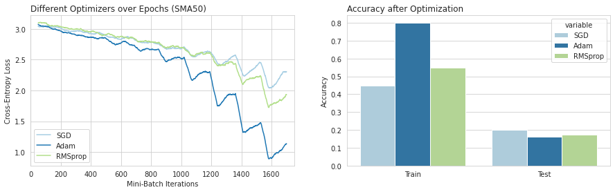

# Study Course Deep Learning MC1 - Image Classification

**Author:** Simon Staehli / 5Da

## Einleitung

Dieses Markdown dient als Dokumentation vom gesamten Code, den ich während der Mini-Challenge geschrieben habe. Dabei werde ich einzelne Bestandteile als Bilder hier darstellen und passend erläutern. Dies bietet vor allem den Vorteil, da das Notebook eine sehr grosse Durchlaufzeit benötigt und es so einfacher ist. Für den COde verweise ich innerhalb dieses Markdowns auf das Notebook `del_image_classification.ipynb`.

## Use-Case

Für diese Mini-Challenge habe ich ein eigenen Datensatz zusammengestellt aus diversen Bilder, welche mit Klassen gelabelt sind.
Der Datensatz besteht aus ca. 29'000 Bilder und 28 Labels. 1000 Bilder pro Label. Die Daten habe ich von der folgenden Webseite kollektiert: https://500px.com/. Das Ziel ist es nun die Bilder anhand dieser Labels richtig zu labeln. Dies möchte ich anhand eines CNN-Models erreichen. Im Nachfolgenden werde ich verschiedene Modelle, Optimizer, Regularisierungsmethoden vergleichen. Ausserdem werde ich Transfer-Learning anhand eines vortraininerten Neuronalen Netzes verwenden, dass auf einem weitaus grösseren Datensatz vortrainiert wurde, wie z.B. ImageNet.

### Datenqualität

Die Datenqualität und die Ground Truth entspricht den vorhandenen Abstraktion der Nutzer der Webseite. Es kann sein, dass die Klassenunterteilung einen hohen Bias hat, zumal Bilder unterschiedlicher Bildklassen sehr ähnlich aussehen können.

1. Bias durch das Labelling der Nutzer
2. Bias durch sehr ähnlich aussehende Klassen. z.B. Celebrities und People
3. Falsch gesetzte Labels

Dies könnte in einem nächsten Schritt umgagngen werden, wenn zum Beispiel die Bildklasse Celebrity mit People kombiniert wird, da eine Unterscheidung selbst für das menschliche Auge schier unmöglich ist.

# Vorbereitung des Datensatzes

### Generierung Datensatz für Train-Test-Split

Nun werde ich nachfolgend basierend auf meinen gesammelten Daten eine neue Ordnerstruktur generieren, ein Train-Test Split Erstellen und als Dictionary speichern und das Dictionary vorbereiten für das Kopieren der Bilder in einen Neuen Ordner mit Multiprocessing. Die Ordnerstruktur ist nach dem Pre-Processing in zwei separate Subordner _train_ und _test_ aufgeteilt. Diese beinhalten weitere Subordner mit den Labelnamen und deren Bilder. Das ganze habe ich im Verhältnis 0.9 gesplittet.

## Dataloader

Zuerst muss ich einige Preprozessierungsschritte bei der Bearbeitung der Bilder vornehmen. Dafür verwende ich die Klasse `Compose` von torchvision. Torchvision beinhaltet auch Schritte, die auf Bilder angewendet werden können. Für meine Bilder verwende ich: `Resize, CenterCrop, ToTensor` in dieser Reihenfolge.

|  | 
|:--:| 
| *Sample Bilder aus meinem Datensatz* |


Man kann nun sehen, dass alle Bilder die gleiche Grösse haben und ähnlich aussehen. Das Preprocessing mit Pytorch hat funktioniert. 
Nun werde ich den gleichen Schritt nochmals wiederholen, nur werde ich noch eine Normalisierung des Tensors anfügen.


# Convolutional Neuronal Network

## Theorie

- Filter erklärt anhand Strukturabbild
- Berechnung der Feature Map Grösse erklärt
- Gradient der Filterweights

## Implementation von AlexNet

### Architecture

Architecture von ALexnet

### Code

```python
class AlexNet(nn.Module):
    def __init__(self, n_classes):
        super(AlexNet, self).__init__()
        self.conv1 = nn.Conv2d(in_channels=3, out_channels= 96,
                               kernel_size= 11, stride=4, padding=0)
        self.maxpool = nn.MaxPool2d(kernel_size=3, stride=2)
        self.conv2 = nn.Conv2d(in_channels=96, out_channels=256,
                               kernel_size=5, stride= 1, padding= 2)
        self.conv3 = nn.Conv2d(in_channels=256, out_channels=384,
                               kernel_size=3, stride= 1, padding= 1)
        self.conv4 = nn.Conv2d(in_channels=384, out_channels=384,
                               kernel_size=3, stride=1, padding=1)
        self.conv5 = nn.Conv2d(in_channels=384, out_channels=256,
                               kernel_size=3, stride=1, padding=1)
        self.fc1  = nn.Linear(in_features= 9216, out_features= 4096)
        self.fc2  = nn.Linear(in_features= 4096, out_features= 4096)
        self.fc3 = nn.Linear(in_features=4096 , out_features=n_classes)

    def forward(self,x):
        x = F.relu(self.conv1(x))
        x = self.maxpool(x)
        x = F.relu(self.conv2(x))
        x = self.maxpool(x)
        x = F.relu(self.conv3(x))
        x = F.relu(self.conv4(x))
        x = F.relu(self.conv5(x))
        x = self.maxpool(x)
        x = x.reshape(x.shape[0], -1)
        x = F.relu(self.fc1(x))
        x = F.relu(self.fc2(x))
        x = self.fc3(x)
        return x
```

### Vorhersagen

### Vergleich Optimizer

Den Vergleich der Optimizer überwache ich über den Lernprozess hinweg. Über den Lernprozess kann man sehen, wie sich der Optimzer verhält über die einzelnen Batches verhält, sprich wie sich die Kostenfunktion mit steigender Iteration verändert. Bezüglich der Reproduzierbarkeit habe ich nach einer Epoch von SGD die Modellparameter abgespeichert, die ich nun als Ausgangspunkt für alle Optimizer verwende. Ausserdem verwende ich für den Vergleich die gleiche Anzahl der Epochen, nämlich 10. Es ist hier zu erwähnen, dass ein Vergleich schwer fällt, da die Optimizer verschiedene Parameter verfügen z.B. Lernrate und Momentum bei SGD, die man ebenfalls berücksichtigen muss beim Training. Dies werde ich jedoch im Prozess nicht stark berücksichtigen. Ich habe für meinen Teil einige Durchläufe gemacht und geschaut wie sich die laufenden Kosten verändern. Zu schwache Veränderungen habe ich mit einer Erhöhung der Kostenfunktion gegensteuert.

#### SGD

Stochastic Gradient Descent nimmt über jeden Batch hinweg ein Random Sample mit welchem er dann die Gewichte updated. Dies hat den Vorteil, dass die Rechenintesität viel kleiner wird, zu mal bspw. nur ein Sample verarbeitet werden muss. Teilweise werden auch mehrere kleinere Samples genommen (Batches). [(Srinivasan, 2019)](https://towardsdatascience.com/stochastic-gradient-descent-clearly-explained-53d239905d31)


#### Adam

#### RMSprop

### Vergleich

|  | 
|:--:| 
| *Vergleich der Optimizer über Batches hinweg* |


# Quellen

https://towardsdatascience.com/stochastic-gradient-descent-clearly-explained-53d239905d31

